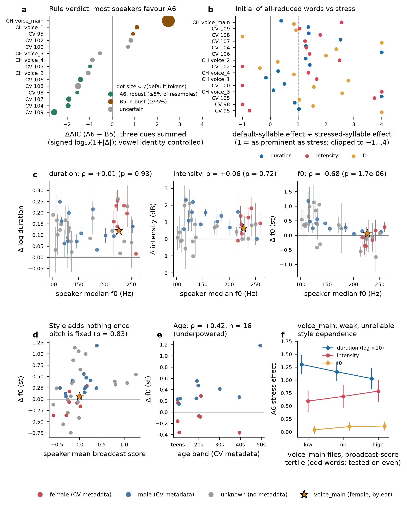

# Do Chuvash speakers differ in stress *rules* or in stress *cues*? — 2026-10-02

Scripts: `9-analyze/analyses/speaker_cues/` (`models/`, `broadcast_score/`, `loan_lexicon/`, `mari_literature/`).
Outputs: this directory. Every number below is read from a CSV in it. Inputs come from three tracks: the Mari
literature (`mari_literature/FINDINGS.md`), the broadcast score (`broadcast_score/FINDINGS.md`) and the loan lexicon
(`loan_lexicon/FINDINGS.md`).

## Short answer

1. **Mostly the same rule, different cues.** Duration, intensity and f0 each favour a different rule family. The direction is
   the same across speakers: duration leans B, while intensity and f0 lean A. A speaker's overall verdict depends on how the cues
   are weighted, and on one control that matters, vowel identity (below). With vowel identity controlled, 21 of 40 speakers favour A6, 9 B5 and
   10 are tied. Among the 15 speakers with enough rule-discriminating tokens, A6 wins robustly for 6. B5 wins robustly for
   only `voice_main`, plus two smaller voices that drop just under the robustness line once loans are excluded.
2. **The A6 default is phonetically real for most speakers.** With vowel identity controlled, the first syllable of an all-reduced word is louder and
   longer than a matched initial syllable. It is roughly as prominent as a stressed syllable for Common Voice speakers, which is
   what Vaysman (2009) reports for Meadow Mari. `voice_main` is the exception: her default syllables carry 2.6× the stress
   intensity effect but only 39% of its duration effect. Because she is 73.6% of the data, the pooled duration models favour B5.
3. **The structured speaker variation is in f0, and it tracks pitch register, not style.** Speakers with higher voices use
   f0 less for stress: ρ = −0.68 (n = 40). By Common Voice metadata, women's median f0 slope is −0.08 st against +0.26 st for men (p = .005, n = 19).
   Once median pitch is held fixed, no broadcast-style measure predicts f0 use (p = .48–.86).
4. **The newscaster-style hypothesis is not supported as stated.** The style metrics do not form a single dimension, and they do not
   reliably separate one file from another within `voice_main`. Where the score does predict cue size, the direction is the opposite
   of the prediction: more broadcast-like means slightly *larger* f0 and intensity effects. `voice_main` is distinctive on two
   single metrics: she is the fastest of 39 speakers and has the 3rd-lowest utterance-final f0. Her near-zero f0 cue fits
   her pitch register (≈226 Hz) as well as the other high voices do.

## 1. Your controls work

Pooled models (`models/pooled_models.csv`; 517,263 vowels in 2–6-syllable words, 120 speakers):
DV centred within recording ~ rule + syllable 1 + syllable 2 + word-final + utterance-final word + utterance-final syllable + (1 | word type).
All nine rule designs are full rank. The control estimates under B5:

| control | duration (log) | intensity (dB) | f0 (st) |
|---|---|---|---|
| syllable 1 | −0.016 | −0.49 | **+0.91** |
| syllable 2 | −0.025 | **+0.80** | +0.44 |
| word-final syllable | +0.030 | −0.57 | +0.59 |
| utterance-final word | −0.034 | −1.43 | −0.97 |
| utterance-final syllable (additive) | **+0.385** | **−5.09** | **−2.37** |

This confirms each of your expectations: syllable 2 raises intensity, syllable 1 raises f0, and the last syllable of the last word is
much longer (+47%), quieter and lower.

**Pooled rule ranking under these controls** (ΔAIC from the best rule within each cue):
- duration: B5 0, B4 42, B6 899, A6 3,476
- intensity: SON_A 0; among A/B rules, A4–A6 2,772–2,836 vs B5 3,102 and B6 3,519
- f0: B6 0, A6 24, B5 88

Excluding the lexicon-flagged loans changes none of the orderings (`models/pooled_models_loan_exclusion.csv`).

**What "canonical f0" means now.** This spec gives +0.16 st for f0 on all data (B5), +0.30 st without `voice_main`.
`voice_main`'s own f0 effect is near zero, so pooled f0 figures always understate other speakers. Report f0 per speaker or without her.

## 2. Per speaker: rules

`models/02_speaker_models.py`, 40 speakers (≥ 200 vowels in ≥ 10 recordings). Every rule × cue is fitted by OLS on the same
rows, with cluster-robust SEs by word type and the DV centred within recording. A6 and B5 disagree on only 2.7% of vowels, almost all of them the first syllable of
all-reduced words. Only 15 speakers have ≥ 30 such tokens, so a speaker-level A6-vs-B5 verdict is possible for those 15 alone.

| combined A6 vs B5 verdict (ΔAIC > 2) | A6 | B5 | tie |
|---|---|---|---|
| your positional spec | 14 | 17 | 9 |
| + vowel identity | 21 | 9 | 10 |
| + vowel identity, loans excluded | 19 | 10 | 11 |

**Why vowel identity belongs in this comparison.** The disputed syllables are reduced vowels under both rules. Without a vowel
control, coding a reduced vowel "stressed" (A6) is penalised for its short intrinsic duration. With the control, the comparison is
reduced vowel vs reduced vowel. This is narrower than the project rule that vowel controls cannot test an A/B rule. That rule
concerns full-vs-reduced designation, which A6 and B5 share.

Bootstrap over recordings (200 resamples; `models/speaker_bootstrap_vowelctrl.csv`):
- A6 robust (B5 wins in ≤ 5% of resamples): cv_104, cv_106, cv_107, cv_109, cv_98, cv_105
- B5 robust (≥ 95%): chv_voice_main (100%), chv_voice_1 (96.5%), cv_95 (96.0%). The last two fall to 92.5% and 93.5% once loans are excluded.
- Uncertain: 6. Not assessable: 25.

## 3. The default syllable directly

Head-to-head model per speaker: DV ~ both + A6_only + B5_only + controls + vowel identity. A6_only is the syllable A6 calls
stressed and B5 does not: the initial syllable of an all-reduced word.

The coefficient is never significantly negative. The number of speakers (of 15) with a significantly positive effect, by control set:

| control set | duration | intensity | f0 |
|---|---|---|---|
| vowel identity | 6 | 12 | 8 |
| comparison excludes directly pre-tonic initials | 7 | 12 | 3 |
| + word-length dummies | 9 | 10 | 6 |
| three-syllable words only (10 speakers) | 4 | 5 | 0 (voice_main −) |

The f0 support is fragile: it shrinks once pre-tonic comparison syllables are dropped.

Within all-reduced words, syllable 1 has a higher duration estimate than the later syllables of the same words in **15 of 15** speakers
(point estimates; mean +5% net of the word-final and utterance-final controls). It is not louder than them (mean −0.23 dB), and the later syllables are mostly not
elevated (duration + in 3 of 15), so this is not a whole-word effect (`models/speaker_allreduced_wordlevel.csv`).

**Size relative to real stress** (`models/speaker_default_vs_stress_ratio.csv`): default-syllable effect ÷ the effect of syllables both rules
stress. The median ratio is 1.27 for duration and 1.36 for intensity. `voice_main` is 0.39 for duration and 2.56 for intensity.
For Common Voice speakers the default syllable is as prominent as stress. That fits Vaysman's statement for Meadow Mari that stressed
initial schwas "exhibit the same characteristics as other stressed vowels" (p. 64 fn 22), and Lehiste et al.'s 101 vs 46 ms for
stressed vs unstressed initial /ə/.

**Caveats.** The comparison syllables are pre-tonic, so pre-tonic compression could inflate the contrast. The
non-adjacent, length-controlled and three-syllable-only variants are the guards against that, and they shrink the effect without
reversing it. This cross-word contrast also differs from the earlier within-word contour analysis, which found syllable 1 of all-reduced words
unmarked by raw per-token duration peaks. The within-word duration result here (15/15) controls final lengthening, and the earlier test did not.

## 4. Per speaker: cues

Under A6 with vowel identity controlled (`models/speaker_profiles.csv`), significant positive cues:

| cue profile | speakers |
|---|---|
| length + intensity + f0 | 11 |
| length + intensity | 7 |
| length + intensity, f0 negative | 4 |
| length only | 5 |
| length (+ another cue negative) | 2 |
| length + f0 | 2 |
| other (f0 only, intensity only, intensity + f0) | 4 |
| no significant cue (small speakers) | 5 |

Your three-cue criterion is met individually by 11 of 40. Cue attributes (`models/speaker_cue_attribute_associations.csv`, Spearman):
- **f0 cue size**: median pitch ρ −0.68 (p 2×10⁻⁶); mean broadcast score +0.56; median final f0 +0.50; f0 variability −0.35; age +0.42 (n 16, p .10).
- **Gender** (CV metadata, n 19): women −0.08 vs men +0.26 st (p .005).
- **Duration**: no attribute predicts it, so it is the speaker-general cue.
- **Intensity**: faster speakers use it less (ρ −0.32, p .046). This is a single nominal result among 21 tests.
- **Holding pitch fixed** (`models/speaker_cue_style_partial_pitch.csv`), no style metric predicts f0 use (p .48–.86), while log pitch stays at
  p ≤ .002. The one surviving style effect is rate on intensity (b −0.61 dB per vowel/s, p .02).

## 5. Style

- **Broadcast score** (`broadcast_score/FINDINGS.md`): 9 metrics, mean of oriented z-scores, 37,287 files scored.
  - PC1 explains only 24% of variance, and a deep final fall works against low f0 variability.
  - Within `voice_main` the odd-word and even-word scores correlate at ρ = −0.075, so file-to-file style differences are not reliable there.
  - Numerals in the transcript lower the score by 0.46 (aligner mismatch).
  - A 30-file listening list is in `broadcast_score/listening_list.csv`.
- **Used as an additive control**, the score is absorbed by recording-centred DVs. Its useful form is as a moderator.
- **Cross-fitted moderator** (odd-word score, tested on even words; `models/pooled_broadcast_decomposition_crossfit.csv`):
  - Within speakers: duration −0.007 [−0.014, 0.000]. The uncross-fitted −0.06 was circular. Intensity +0.28 dB [0.18, 0.38]; f0 +0.14 st [0.10, 0.18].
  - Between speakers: duration −0.064; intensity +1.40 dB; f0 +0.93 st per unit of speaker mean score. Pitch accounts for the f0 part (§4).
- **Within `voice_main`** (`models/voice_main_style_test.csv`), from the least to the most broadcast-like tertile:
  - A6 duration 0.130 → 0.116 → 0.103, overlapping CIs; the continuous interaction is +0.014, so the direction is unresolved.
  - Intensity 0.59 → 0.79 dB.
  - f0 0.04 → 0.11 st.

  Read this as weak, given the reliability.

## 6. Mari comparison (literature)

- **Vaysman (2009)**, full dissertation; the attached PDF was front matter only. Meadow Mari stress falls on the rightmost full vowel **in underived words**, otherwise on the
  leftmost syllable. She rejects a stressless default (fn 22, against Dobrovolsky 1999 on Chuvash). Suffix interactions are
  morphological: all-schwa roots lose stress to full-vowel suffixes, and /a/-suffixes attract stress after full + schwa roots, /e/-suffixes do not.
- **Lehiste et al. (2005)**: 8 speakers, read contrastive frame. Duration is "the most reliable phonetic correlate of stress", >1 in 12/12
  speaker cells. f0 is an auxiliary cue overridden by sentence intonation. Intensity was not measured.
- **The cue hierarchy is the same in Chuvash and Mari**: duration is general, and f0 is secondary and context-bound. Mari's intensity and its high-voice
  f0 attenuation are not assessed. Mari's morphological conditioning has not yet been tested in Chuvash.

## Decisions and questions for Kate

1. **Vowel identity in the A6-vs-B5 comparison.** It moves the per-speaker verdict from 14/17 to 21/9 (A6/B5), and the argument for it is in §2.
   Do you accept it for this comparison?
2. **voice_main as the B5 speaker.** Her B5 lean comes from duration alone (default syllables 39% of stress duration but louder than stress).
   Is that a reading-style compression of reduced vowels, or a genuine stressless default? Listening to her all-reduced words would help (`models/speaker_head_to_head_vowelctrl.csv` lists the speakers).
3. **Mari morphology.** Vaysman's rule holds for underived words only. Should the Chuvash A/B test be restricted to monomorphemic stems (the
   existing `morph_induction` parse) to match?
4. **f0 and pitch register.** Higher voices use f0 less. Is that worth framing as a sex difference in Chuvash prosody, given the 19
   metadata-gendered speakers and `voice_main`? It needs verified gender for more Common Voice speakers.
5. **Listening list.** Do the 15 "most broadcast-like" files sound like newscaster prosody to you? If not, the metric set needs revising
   before style can be tested.

## Caveats

- Rule labels are predictions, not perceived stress.
- Common Voice "speakers" are client IDs; the Chuvash Voice minor clusters are acoustic clusters, not verified people.
- f0 is stylised to 2 st and measured at the vowel midpoint, so a late peak would be missed.
- Durations are quantised to 10 ms with a 30 ms floor.
- The per-speaker models are OLS with recording-centred DVs, a fast spec that matched lmer within 0.006–0.033 units on the overnight data.
- Speaker-attribute tests are many (21) on n = 40, 19 or 16, so read anything near p = .05 as nominal.
- Loan-flag precision is ≈0.90 type / 0.85 token for the lexicon additions, and some loan rules were tuned on the validation set.
